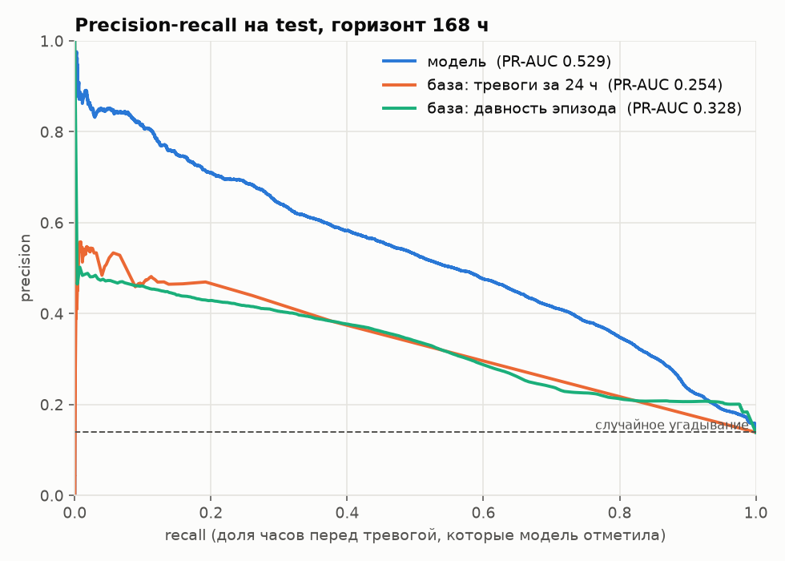
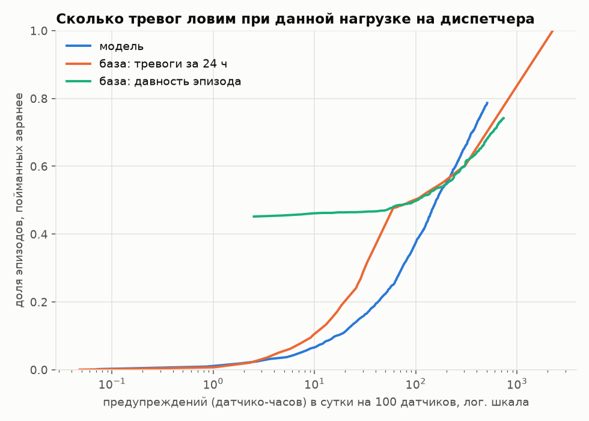
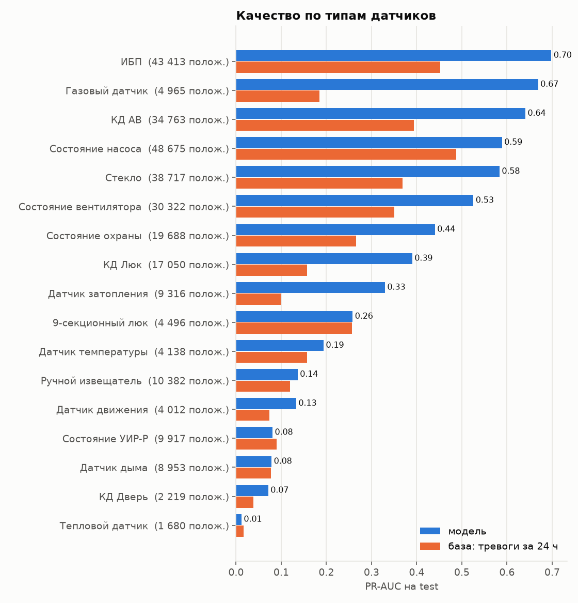
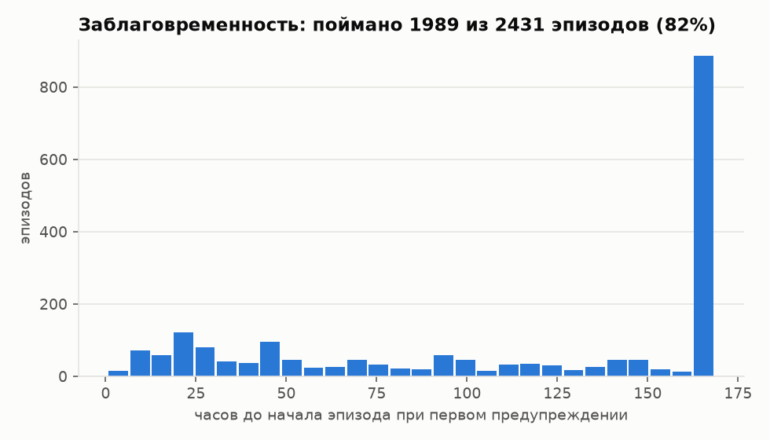

# ASTRA ML — прогноз тревог и детектор аномалий датчиков (08.ДЖКХ)

Модель для журнала событий датчиков инженерных систем объектов (газ, дым,
двери, насосы, ИБП и т. д., 19 типов, 2019–2026). Решает две задачи:

1. **Прогноз.** Для каждого датчика на конец каждого часа — вероятность того, что **в ближайшие
   7 суток начнётся новый эпизод тревоги**. На выходе — список датчиков, отсортированный по риску.
2. **Аномалии.** Датчики, которые ведут себя необычно: «дребезг», внезапное молчание, всплески
   значений или ритма срабатываний (IsolationForest по типам + правила).

Разметки «подтверждённый инцидент / ложное срабатывание» в данных нет, поэтому цель строится
из самих данных: будущее известно на истории. Подробное устройство модели, все параметры и
частые проблемы — в [djkh_model/README.md](djkh_model/README.md).

---

## Итоговая модель: `out_final/`

LightGBM, 134 признака, горизонт 168 ч. Обучена на срезе `sample_30.parquet`
(547 датчиков всех типов). Разбиение только по времени: train 2022–2024, valid 2025,
**test — январь–июнь 2026** (модель его не видела ни при обучении, ни при выборе порога).

| метрика (test 2026) | значение | для сравнения |
|---|---|---|
| **эпизодов поймано заранее** | **82 %** (1989 из 2431) | — |
| медиана заблаговременности | 142 ч (~6 суток) | — |
| precision при пороге | 0.40 | доля тревожных часов 0.14 |
| **PR-AUC** | **0.529** | правило «давность эпизода» 0.328, «тревоги за 24 ч» 0.254 |
| ROC-AUC | 0.849 | — |
| PR-AUC train / valid | 0.632 / 0.539 | valid ≈ test — результат устойчив |

- Из датчиков, у которых был эпизод за последние 30 дней, поймано 93 %; из давно молчавших — 52 %.
- Лучше всего работает для ИБП (PR-AUC 0.70), газа (0.67), КД АВ (0.64), насосов (0.59), стекла (0.58).
  Слабо — для дыма, тепловых, дверей, УИР-Р (≤ 0.08): в срезе мало их эпизодов.
- Порог выбран на valid так, чтобы поймать 85 % эпизодов. Больше пойманных ценой точности:
  `--target-caught 0.9` даёт 86 % при precision 0.36; меньше ложных: `--target-caught 0` (максимум F1).

| | |
|---|---|
|  |  |
|  |  |

Все графики — в [out_final/plots/](out_final/plots/): PR-кривые, PR-AUC по выборкам, типам и
месяцам, пойманные эпизоды против числа предупреждений, заблаговременность, калибровка,
важность признаков.

---

## Структура

```
ml/
├── README_MODEL.md         этот файл
├── djkh_model/             код модели
│   ├── model.py            агрегация, признаки, обучение, оценка, аномалии, прогноз (train / predict)
│   ├── improve.py          автоподбор: наборы признаков, Optuna, модели по группам датчиков
│   ├── plots.py            графики качества по папке с обученной моделью
│   ├── checks.py           проверка нормировки датасета, скользящих признаков и утечки будущего
│   ├── README.md           подробная документация модели
│   ├── requirements.txt
│   └── dicts/              справочники (как в data_pipeline/lct_features/dicts)
├── make_sample.py          вырезает срез датчиков из полных данных -> sample_30.parquet
├── out_final/              итоговая модель: lgb_model.txt + artifacts.json (этого достаточно
│                           для predict), метрики, отчёты об аномалиях, графики
│
│   --- не хранится в git (большие файлы, создаются локально) ---
├── data/                   dataset_ml_YYYY.csv.gz - выгрузка организаторов, 4.3 ГБ
├── sample_30.parquet       срез 547 датчиков, 185 МБ (make_sample.py)
└── out_final/iso_forest.joblib, predictions_test.csv.gz   (создаёт train)
```

Описание датасета и каталог признаков организаторов — в
[data_pipeline/docs/](../data_pipeline/docs/).

---

## Как запустить

Все команды выполняются из папки `ml/`. Выгрузку организаторов (`dataset_ml_YYYY.csv.gz`)
положите в `ml/data/`.

```bash
cd ml
python3 -m venv .venv && source .venv/bin/activate
pip install -r djkh_model/requirements.txt

# прогноз по итоговой модели: ранжирование датчиков на последний час данных
python djkh_model/model.py predict --data data/dataset_ml_2026.csv.gz --out out_final
#   -> out_final/risk_ranking.csv

# переобучение с нуля (~2 мин, пик памяти ~8.5 ГБ) и графики
python djkh_model/model.py train --data sample_30.parquet --out out_final
python djkh_model/plots.py --out out_final

# проверка корректности данных и признаков (~3 мин)
python djkh_model/checks.py --data sample_30.parquet

# пересборка среза из полных данных (~1 мин); на машине с 8 ГБ - 20 датчиков на тип
python make_sample.py 30 sample_30.parquet
```

Для `predict` нужна история не меньше 90 дней до момента прогноза (самое длинное окно признаков),
поэтому подавайте годовой файл.

---

## Что было исправлено в исходном решении

| проблема | последствие | исправление |
|---|---|---|
| `make_sample.py` читал CSV без явных типов | duckdb принимал `значение` за целое и округлял газ (0.01…1.49 % метана → 0/1): 4512 ложных «газовых тревог» в срезе вместо 348 | типы колонок заданы явно, срез пересобран |
| «Норма» и «Выключен» считались неисправностями (флаг `состояние_техническое`) | признаки «сбоев» в основном считали штатные события (у дверей «Норма» = дверь закрылась) | неисправность = «Не определено», «Неисправен», «Неопределен», «Отключено устройство», служебный код, сбитая дата |
| `age_h`, `start_rate_all` считались от начала загруженного файла | на обучении — прокси календарной даты (переобучение), в `predict` — другие числа | окна ограничены 90 днями |
| `predict` падал с `KeyError` на типах без числовых значений | — | набор колонок не зависит от данных |
| горизонт 24 ч, порог по максимуму F1 | ловилось 31 % эпизодов | горизонт 168 ч, порог под долю пойманных эпизодов |

Добавлено: признаки регулярности эпизодов (обычный интервал между эпизодами и насколько очередной
«запаздывает», недели с эпизодами за 12 недель, то же время год назад, «висящая» тревога),
срез побольше, графики, проверки. Путь по шагам на одних и тех же датчиках test:
PR-AUC 0.500 → 0.507 (признаки) → 0.516 (больше датчиков).

**Проверено** (`checks.py`): нормировка датасета (`значение_z`, `лог_dt`, `лог_dt_z`) совпадает
с независимым пересчётом по сырым значениям до 1e-5; скользящие суммы, максимумы и средние
совпадают с наивным расчётом; ни один из 134 признаков не использует будущее (признаки на данных,
обрезанных в момент T, совпадают с признаками на полных данных).

---

## Ограничения и что дальше

- **Нет подтверждённых инцидентов** — модель предсказывает тревоги в том виде, в каком их записала
  система, включая ложные.
- **Обучено на срезе** (547 из 11 485 датчиков). Главный резерв качества — полные данные, особенно
  для редких типов (дым, двери, тепловые) и признаков соседей; для этого нужно сократить расход
  памяти (сейчас ~15 МБ на датчик).
- «Холодные» эпизоды (первое срабатывание давно молчавшего датчика) почти не имеют предвестников
  в данных — это естественный потолок любой модели.
- Состояние насосов «Работают все насосы в АНС» даёт больше всего тревог в цели. Если это рабочий
  режим, его стоит исключить через `exclude_alarm_states` в `model.py`.
